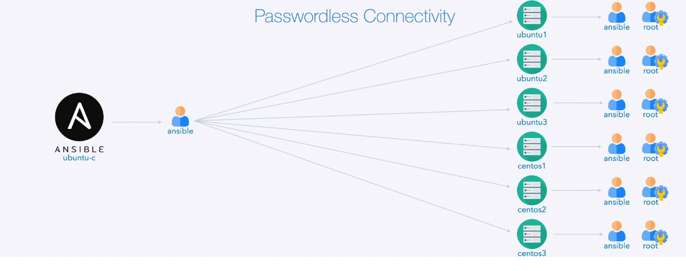

# Ansible: From Zero to Hero

## Pre-requisites

Docker

Docker-compose

Ansible

## Fonts

https://github.com/spurin/diveintoansible-lab

https://www.udemy.com/course/diveintoansible/learn/lecture/23652096#overview

https://docs.ansible.com/

## Configuracao de Chave-SSH

Acesso SSH por chave

```bash
ssh-keygen
ssh-copy-id user@host
```

#### Compartilhamento da chave para diversos hosts

```bash
sudo apt install sshpass -y # Pacote para fazer o passe
echo password > password.txt

# Compartilhar a chave com os Hosts
# ubuntu1 ubuntu2 ubuntu3 => Users: ansible, root
# centos1 centos2 centos3 => Users: ansible, root
for user in ansible root; do
	for os in ubuntu centos; do
		for instance in 1 2 3; do 
			sshpass -f password.txt ssh-copy-id -o StrictHostKeyChecking=no ${user}@${os}${instance};
        done
    done
done
```



### Verificação das comunicação com os hosts

```bash
ansible -i,ubuntu1,ubuntu2,ubuntu3,centos1,centos2,centos3 all -m ping
# -i -> inverntory (grupo a receber o comando)
# -m -> module (dafault=command)
```


## Arquivo de configuração 

```bash
ansible --version
#config file = none

# Ordem de prioridade
1 - ANSIBLE_CONOFIG # ENV var pointing to file
2 - ./ansible.cfg # Current Directory
3 - ~/ansible/.ansible.cfg # (Hidden File)
4 - /etc/ansible/ansible.cfg
```


## Inventory

Parte mais ampla da definição dos Hosts controlados pelo Ansible Master.

```bash
etc/ansible/hosts # --> Arquivo default de configuração do inventario
```

Sobreposição do arquivo

```bash
# ansible.cfg
[defaults]
inventory = hosts #-> Sobrepõe para ./hosts
host_key_checking = False
```

#### Comandos

```bash
ansible {grupo} --list-hosts
#          '---------> all, ubuntu, centos, linux
```


#### Hosts Simple file

```bash
#host
[controller]
ubuntu-c ansible_connection=local

[centos] # -> Grupo
centos1  # -> Host
centos2  # -> Host
centos3:2222 # Porta SSH 2222

[ubuntu]
ubuntu1  ansible_user=root # Loga como root 
ubuntu2  ansible_become=true ansible_become_pass=password  # Loga como user ansible com privilégios
ubuntu3  ansible_port=2222 # Porta SSH 2222

```

#### Hosts Advnced File

```bash
[control]
ubuntu-c ansible_connection=local

[centos]
centos1 ansible_port=2222
centos[2:3] # -> REGEX centos2, centos3

[centos:vars] # Variaveis para grupo
ansible_user=root

[ubuntu]
ubuntu[1:3]

[ubuntu:vars]
ansible_become=true
ansible_become_pass=password

[linux:children] # Grupo de Grupos
centos
ubuntu
```

#### Hosts.yml

```yaml
---
control:
  hosts:
    ubuntu-c:
      ansible_connection: local
centos:
  hosts:
    centos1:
      ansible_port: 2222
    centos2:
    centos3:
  vars:
    ansible_user: root
ubuntu:
  hosts:
    ubuntu1:
    ubuntu2:
    ubuntu3:
  vars:
    ansible_become: true
    ansible_become_pass: password
linux:
  children:
    centos:
    ubuntu:
...
```

#### Convert .yml to json

```bash
python3 -c 'import sys, yaml, json; json.dump(yaml.load(sys.stdin, Loader=yaml.FUllLoader), sys.stdout, indent=4)' < hosts.yaml L hosts.json
```

#### Hosts.json

```json
{
    "control": {
        "hosts": {
            "ubuntu-c": {
                "ansible_connection": "local"
            }
        }
    }, 
    "ubuntu": {
        "hosts": {
            "ubuntu1": null, 
            "ubuntu2": null, 
            "ubuntu3": null
        }, 
        "vars": {
            "ansible_become": true, 
            "ansible_become_pass": "password"
        }
    }, 
    "centos": {
        "hosts": {
            "centos3": null, 
            "centos2": null, 
            "centos1": {
                "ansible_port": 2222
            }
        }, 
        "vars": {
            "ansible_user": "root"
        }
    }, 
    "linux": {
        "children": {
            "centos": null, 
            "ubuntu": null
        }
    }
}
```


## Modules

Módulos são unidades discretas (pacotes independentes) de código usadas direto pela linha de comando ou por Playbook. Os módulos são executados no nó e retorna os valores de coleta.

No Ansible +2.10 os módulos estão em coleções


### Ansible-doc

Equivalente ao "man" do Linux para pesquisas e manual sobre os modules

```bash
ansible-doc {module} # file, fetch...
```


### Lista de Modules Uteis

* Setup
* File
* Copy & Fetch
* Command & shell
* Color & Idempotence

```bash
ansigle {host} -m {module}
#				'---> --module
```


#### Setup Module

Modulo executado automaticamente quando usado um Playbook. 

Esse modulo retorna informações (denominada de "facts") dos modulos mencionados

```bash
ansible {node} -m setup
```

#### File Module ( Linux = touch, copy, rm, mkdir )

Modulo para manipulação de arquivos. Links, diretóios, permissões, etc

```bash
ansible all -m file -a 'path=/tmp/test state=touch'
```


#### Ansible Colors Module

Sempre é executado junto com o principio de alterar a cor da resposta do module, seguindo o padrão:

* Vermelho = Falha
* Amarelo   = Sucesso, com alterações
* Verde        = Sucesso, sem alterações


#### Copy & Fetch ( Linux = scp )

Copy Copia arquivos locais para os nodes remotos

Fetch copia arquivos remotos para o local

```bash
ansible all -m copy -a 'src=/tmp/x dest=/tmp/y'
ansible all -m fetch -a 'src=/tmp/x dest=/tmp/y'
```


#### Command Module (Modulo Padrão)

!!! Não identifica caracteres especiais

Modulo para execução de comandos


## Playbooks

https://docs.ansible.com/ansible/latest/collections/ansible/builtin/index.html

Ansible Builtin Collections

#### Become Plugins

- [runas](https://docs.ansible.com/ansible/latest/collections/ansible/builtin/runas_become.html#ansible-collections-ansible-builtin-runas-become) – Run As user
- [su](https://docs.ansible.com/ansible/latest/collections/ansible/builtin/su_become.html#ansible-collections-ansible-builtin-su-become) – Substitute User
- [sudo](https://docs.ansible.com/ansible/latest/collections/ansible/builtin/sudo_become.html#ansible-collections-ansible-builtin-sudo-become) – Substitute User DO

#### Connection Plugins

- [local](https://docs.ansible.com/ansible/latest/collections/ansible/builtin/local_connection.html#ansible-collections-ansible-builtin-local-connection) – execute on controller
- [ssh](https://docs.ansible.com/ansible/latest/collections/ansible/builtin/ssh_connection.html#ansible-collections-ansible-builtin-ssh-connection) – connect via ssh client binary

### Lookup Plugins

- [config](https://docs.ansible.com/ansible/latest/collections/ansible/builtin/config_lookup.html#ansible-collections-ansible-builtin-config-lookup) – Lookup current Ansible configuration values
- [csvfile](https://docs.ansible.com/ansible/latest/collections/ansible/builtin/csvfile_lookup.html#ansible-collections-ansible-builtin-csvfile-lookup) – read data from a TSV or CSV file
- [dict](https://docs.ansible.com/ansible/latest/collections/ansible/builtin/dict_lookup.html#ansible-collections-ansible-builtin-dict-lookup) – returns key/value pair items from dictionaries
- [env](https://docs.ansible.com/ansible/latest/collections/ansible/builtin/env_lookup.html#ansible-collections-ansible-builtin-env-lookup) – Read the value of environment variables
- [file](https://docs.ansible.com/ansible/latest/collections/ansible/builtin/file_lookup.html#ansible-collections-ansible-builtin-file-lookup) – read file contents
- [vars](https://docs.ansible.com/ansible/latest/collections/ansible/builtin/vars_lookup.html#ansible-collections-ansible-builtin-vars-lookup) – Lookup templated value of variables

### Modules

- [add_host](https://docs.ansible.com/ansible/latest/collections/ansible/builtin/add_host_module.html#ansible-collections-ansible-builtin-add-host-module) – Add a host (and alternatively a group) to the ansible-playbook in-memory inventory
- [apt](https://docs.ansible.com/ansible/latest/collections/ansible/builtin/apt_module.html#ansible-collections-ansible-builtin-apt-module) – Manages apt-packages
- [command](https://docs.ansible.com/ansible/latest/collections/ansible/builtin/command_module.html#ansible-collections-ansible-builtin-command-module) – Execute commands on targets
- [copy](https://docs.ansible.com/ansible/latest/collections/ansible/builtin/copy_module.html#ansible-collections-ansible-builtin-copy-module) – Copy files to remote locations
- [cron](https://docs.ansible.com/ansible/latest/collections/ansible/builtin/cron_module.html#ansible-collections-ansible-builtin-cron-module) – Manage cron.d and crontab entries
- [debug](https://docs.ansible.com/ansible/latest/collections/ansible/builtin/debug_module.html#ansible-collections-ansible-builtin-debug-module) – Print statements during execution
- [expect](https://docs.ansible.com/ansible/latest/collections/ansible/builtin/expect_module.html#ansible-collections-ansible-builtin-expect-module) – Executes a command and responds to prompts
- [fail](https://docs.ansible.com/ansible/latest/collections/ansible/builtin/fail_module.html#ansible-collections-ansible-builtin-fail-module) – Fail with custom message
- [fetch](https://docs.ansible.com/ansible/latest/collections/ansible/builtin/fetch_module.html#ansible-collections-ansible-builtin-fetch-module) – Fetch files from remote nodes
- [file](https://docs.ansible.com/ansible/latest/collections/ansible/builtin/file_module.html#ansible-collections-ansible-builtin-file-module) – Manage files and file properties
- [find](https://docs.ansible.com/ansible/latest/collections/ansible/builtin/find_module.html#ansible-collections-ansible-builtin-find-module) – Return a list of files based on specific criteria
- [get_url](https://docs.ansible.com/ansible/latest/collections/ansible/builtin/get_url_module.html#ansible-collections-ansible-builtin-get-url-module) – Downloads files from HTTP, HTTPS, or FTP to node
- [git](https://docs.ansible.com/ansible/latest/collections/ansible/builtin/git_module.html#ansible-collections-ansible-builtin-git-module) – Deploy software (or files) from git checkouts
- [group](https://docs.ansible.com/ansible/latest/collections/ansible/builtin/group_module.html#ansible-collections-ansible-builtin-group-module) – Add or remove groups
- [hostname](https://docs.ansible.com/ansible/latest/collections/ansible/builtin/hostname_module.html#ansible-collections-ansible-builtin-hostname-module) – Manage hostname
- [iptables](https://docs.ansible.com/ansible/latest/collections/ansible/builtin/iptables_module.html#ansible-collections-ansible-builtin-iptables-module) – Modify iptables rules
- [ping](https://docs.ansible.com/ansible/latest/collections/ansible/builtin/ping_module.html#ansible-collections-ansible-builtin-ping-module) – Try to connect to host, verify a usable python and return `pong` on success
- [script](https://docs.ansible.com/ansible/latest/collections/ansible/builtin/script_module.html#ansible-collections-ansible-builtin-script-module) – Runs a local script on a remote node after transferring it
- [shell](https://docs.ansible.com/ansible/latest/collections/ansible/builtin/shell_module.html#ansible-collections-ansible-builtin-shell-module) – Execute shell commands on targets
- [systemd](https://docs.ansible.com/ansible/latest/collections/ansible/builtin/systemd_module.html#ansible-collections-ansible-builtin-systemd-module) – Manage systemd units
- [tempfile](https://docs.ansible.com/ansible/latest/collections/ansible/builtin/tempfile_module.html#ansible-collections-ansible-builtin-tempfile-module) – Creates temporary files and directories
- [unarchive](https://docs.ansible.com/ansible/latest/collections/ansible/builtin/unarchive_module.html#ansible-collections-ansible-builtin-unarchive-module) – Unpacks an archive after (optionally) copying it from the local machine
- [uri](https://docs.ansible.com/ansible/latest/collections/ansible/builtin/uri_module.html#ansible-collections-ansible-builtin-uri-module) – Interacts with webservices
- [wait_for](https://docs.ansible.com/ansible/latest/collections/ansible/builtin/wait_for_module.html#ansible-collections-ansible-builtin-wait-for-module) – Waits for a condition before continuing
- [wait_for_connection](https://docs.ansible.com/ansible/latest/collections/ansible/builtin/wait_for_connection_module.html#ansible-collections-ansible-builtin-wait-for-connection-module) – Waits until remote system is reachable/usable
- [yum](https://docs.ansible.com/ansible/latest/collections/ansible/builtin/yum_module.html#ansible-collections-ansible-builtin-yum-module) – Manages packages with the *yum* package manager
- [yum_repository](https://docs.ansible.com/ansible/latest/collections/ansible/builtin/yum_repository_module.html#ansible-collections-ansible-builtin-yum-repository-module) – Add or remove YUM repositories

### Shell Plugins

- [cmd](https://docs.ansible.com/ansible/latest/collections/ansible/builtin/cmd_shell.html#ansible-collections-ansible-builtin-cmd-shell) – Windows Command Prompt
- [powershell](https://docs.ansible.com/ansible/latest/collections/ansible/builtin/powershell_shell.html#ansible-collections-ansible-builtin-powershell-shell) – Windows PowerShell
- [sh](https://docs.ansible.com/ansible/latest/collections/ansible/builtin/sh_shell.html#ansible-collections-ansible-builtin-sh-shell) – POSIX shell (/bin/sh)

### Strategy Plugins

- [debug](https://docs.ansible.com/ansible/latest/collections/ansible/builtin/debug_strategy.html#ansible-collections-ansible-builtin-debug-strategy) – Executes tasks in interactive debug session.
- [free](https://docs.ansible.com/ansible/latest/collections/ansible/builtin/free_strategy.html#ansible-collections-ansible-builtin-free-strategy) – Executes tasks without waiting for all hosts
- [host_pinned](https://docs.ansible.com/ansible/latest/collections/ansible/builtin/host_pinned_strategy.html#ansible-collections-ansible-builtin-host-pinned-strategy) – Executes tasks on each host without interruption
- [linear](https://docs.ansible.com/ansible/latest/collections/ansible/builtin/linear_strategy.html#ansible-collections-ansible-builtin-linear-strategy) – Executes tasks in a linear fashion

### Vars Plugins

- [host_group_vars](https://docs.ansible.com/ansible/latest/collections/ansible/builtin/host_group_vars_vars.html#ansible-collections-ansible-builtin-host-group-vars-vars) – In charge of loading group_vars and host_vars


### Sections

```yml
---
# YAML documents begin with the document separator ---

# The minus in YAML this indicates a list item.  The playbook contains a list 
# of plays, with each play being a dictionary
-

  # Hosts: where our play will run and options it will run with

  # Vars: variables that will apply to the play, on all target systems

  # Tasks: the list of tasks that will be executed within the play, this section
  #       can also be used for pre and post tasks

  # Handlers: the list of handlers that are executed as a notify key from a task

  # Roles: list of roles to be imported into the play

# Three dots indicate the end of a YAML document
...
```

### Variables

Interpretação Python com Jinja2

```python
---
  hosts: centos1
  # Vars: variables that will apply to the play, on all target systems
  # Tasks: the list of tasks that will be executed within the playbook
  tasks:
    - name: Test extra vars
      debug:
        msg: "{{ extra_vars_key }}"
# Three dots indicate the end of a YAML document

```


### Facts

Fatos são informações adquiridas pelos nós. IP, Bios, hardware.

Ansible Facts usa o mdoulo setup pra buscar as informações todas vez que um playbook é rodado


O modulo retorna JSON e é acessado em Python

```python
# Facts JSON
ansible all -m setup

# Acesso
ansible_facts["system"]
ansible_facts["all_ipv6_addresses"][1]
ansible_facts["all_ipv6_addresses"][2]
```


### Templating with Jinja2

#### Templates

#### if / elif / else statements

```yml
# Tasks: the list of tasks that will be executed within the playbook
  tasks:
    - name: Ansible Jinja2 if elif
      debug:
        msg: >
             --== Ansible Jinja2 if elif statement ==--

             
                This is ubuntu-c
             
                This is centos1 with it's modified SSH Port
             
                This is good old {{ ansible_hostname }}
             
```


#### For loops

```yml
    - name: Ansible Jinja2 for range, reversed (continue if odd)
      debug:
        msg: >
             --== Ansible Jinja2 for range, reversed (continue if odd) ==--

             
                
                   
                
                {{ entry }}
             
```

#### Ranges

```yml
    - name: Ansible Jinja2 filters
      debug:
        msg: >
             ---=== Ansible Jinja2 filters ===---

             --== min [1, 2, 3, 4, 5] ==--

             {{ [1, 2, 3, 4, 5] | min }}

             --== max [1, 2, 3, 4, 5] ==--

             {{ [1, 2, 3, 4, 5] | max }}

             --== unique [1, 1, 2, 2, 3, 3, 4, 4, 5, 5] ==--

             {{ [1, 1, 2, 2, 3, 3, 4, 4, 5, 5] | unique }}

             --== difference [1, 2, 3, 4, 5] vs [2, 3, 4] ==--

             {{ [1, 2, 3, 4, 5] | difference([2, 3, 4]) }}

             --== random ['rod', 'jane', 'freddy'] ==--

             {{ ['rod', 'jane', 'freddy'] | random }}

             --== urlsplit hostname ==--

             {{ "http://docs.ansible.com/ansible/latest/playbooks_filters.html" | urlsplit('hostname') }}
```

#### Filters

```yml
    - name: Ansible Jinja2 for range
      debug:
        msg: >
             --== Ansible Jinja2 for range

             
                {{ entry }}
             
```


### Register and When

```yml
  tasks:
    - name: Exploring register
      command: hostname -s
      when: 
        - ansible_distribution == "CentOS"   # lista de requisitos (AND)
        - ansible_distribution_major_version | int >= 8 # OR
      register: command_register

    - name: Install patch when changed
      yum:
        name: patch
        state: present
      when: command_register is changed # Registra o resultado na variavel command_register

    - name: Install patch when skipped
      apt:
        name: patch
        state: present
      when: command_register is skipped
```


### Looping

```yml
tasks:
    - name: Creating user
      user:
        name: "{{ item }}"
      with_items: 
        - james
        - hayley
        - lily
        - anwen
tasks:
    - name: Creating user
      user:
        name: "{{ item.key }}"
        comment: "{{ item.value.full_name }}"
      with_dict: 
        james: 
          full_name: James Spurin
        hayley: 
          full_name: Hayley Spurin
        lily: 
          full_name: Lily Spurin
        anwen:
          full_name: Anwen Spurin

tasks:
    - name: Creating user
      user:
        name: "{{ item.1 }}"
        comment: "{{ item.1 | title }} {{ item.0.surname }}"
        # https://docs.ansible.com/ansible/latest/plugins/lookup/password.html
        password: "{{ lookup('password', '/dev/null length=15 chars=ascii_letters,digits,hexdigits,punctuation') | password_hash('sha512') }}"
      with_subelements:
        -
          - surname: Spurin
            members:
             - james
             - hayley
             - lily
             - anwen
          - surname: Darlington
            members:
             - freya
          - surname: Jalba
            members:
             - ana
          - surname: Angne
            members:
             - abhishek
          - surname: Mahmood
            members:
             - sara
        - members

tasks:
    - name: Creating user directories
      file:
        dest: "/home/{{ item.0 }}/{{ item.1 }}"
        owner: "{{ item.0 }}"
        group: "{{ item.0 }}"
        state: directory
      with_together:
        - [ james, hayley, freya, lily, anwen, ana, abhishek, sara ]
        - [ tech, psychology, acting, dancing, playing, japanese, coffee, music ]
tasks:
    - name: Create hex sequence directories
      file:
        dest: "{{ item }}"
        state: directory
      with_sequence: count=5 format=/home/james/count_sequence_%x
  
tasks:
    - name: Run a script until we hit 10
      script: random.sh
      register: result
      retries: 100
      until: result.stdout.find("10") != -1
      # n.b. the default delay is 5 seconds
      delay: 1
      
tasks:
    - name: Create random directory
      file:
        dest: "/home/james/{{ item }}"
        state: directory
      with_random_choice:
        - "google"
        - "facebook"
        - "microsoft"
        - "apple"
```


### Async, Serial, paralel

```yml
  tasks:
    - name: Task 1
      command: /bin/sleep 5
      when: ansible_hostname == 'centos1'

    - name: Task 2
      command: /bin/sleep 5
      when: ansible_hostname == 'centos2'

    - name: Task 4
      command: /bin/sleep 5
      when: ansible_hostname == 'ubuntu1'

    - name: Task 5
      command: /bin/sleep 5
      when: ansible_hostname == 'ubuntu2'

tasks:
    - name: Task 1
      command: /bin/sleep 5
      async: 10
      poll: 0
      register: result1

serial: 2
serial: 
    - 16%
    - 34%
    - 50%
serial: 
    - 1
    - 2
    - 3
```


### Blocks

```yml
tasks:
    - name: Install patch and python-dns
      block:
        - name: Install patch
          package:
            name: patch

        - name: Install python-dnspython
          package:
            name: python-dnspython

      rescue:
        - name: Rollback patch
          package:
            name: patch
            state: absent

        - name: Rollback python-dnspython
          package:
            name: python-dnspython
            state: absent

      always:
        - debug:
            msg: This always runs, regardless
```

